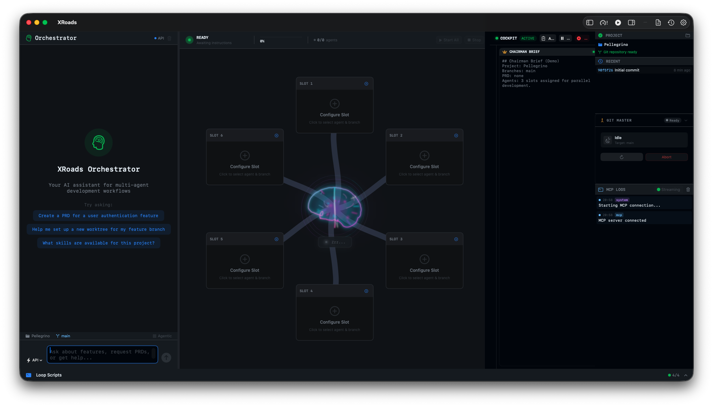

<div align="center">

# XRoads

### Multi-Agent AI Orchestration for macOS

**Run Claude, Gemini, and Codex in parallel on isolated git worktrees.**

[](https://swift.org)
[](https://www.apple.com/macos/)
[](LICENSE)
[](https://modelcontextprotocol.io)

<br />



<br />

*Built by [Neurogrid](https://neurogrid.me)*

</div>

---

## What is XRoads?

**XRoads** is a native macOS application that orchestrates multiple AI coding agents working simultaneously on your codebase. Instead of running one agent at a time, XRoads lets you dispatch Claude, Gemini, and Codex to work in parallel on isolated git worktrees — then intelligently merges their work.

### The Problem

Modern AI coding assistants are powerful, but:
- They work sequentially, one task at a time
- Context switching between agents is manual and tedious
- Merging parallel work from multiple agents is error-prone
- No unified view of what multiple agents are doing

### The Solution

XRoads provides:
- **Parallel Execution**: Up to 6 agents working simultaneously
- **Isolated Worktrees**: Each agent operates on its own git worktree
- **Intelligent Merging**: GitMaster analyzes and resolves conflicts automatically
- **Unified Dashboard**: Real-time monitoring of all agent activity
- **MCP Integration**: Structured logging and status updates via Model Context Protocol

---

## Features

### 🎯 Multi-Agent Orchestration

<table>
<tr>
<td width="50%">

**6-Slot Terminal Grid**

Run up to 6 agents in parallel with real-time output streaming. Each slot is independently configurable with agent type, branch, and action.

</td>
<td width="50%">

**PRD-Driven Dispatch**

Load a Product Requirements Document (PRD) and XRoads automatically distributes stories to available agents based on complexity and dependencies.

</td>
</tr>
</table>

### 🧠 GitMaster — Intelligent Merge Resolution

GitMaster is XRoads' built-in conflict resolution agent that:

- **Analyzes conflicts semantically** — Distinguishes trivial (whitespace) from structural changes
- **Classifies complexity** — Auto-resolvable, needs review, or manual intervention
- **Suggests resolutions** — Keep ours, keep theirs, or AI-generated merge
- **Tracks branches** — Monitors all agent worktrees for completion status

| Conflict Type | Description | Resolution |
|--------------|-------------|------------|
| `trivial` | Whitespace, formatting | Auto |
| `parallel` | Same zone, different changes | Assisted |
| `dependent` | Changes rely on each other | Assisted |
| `structural` | File reorganization | Manual |
| `semantic` | Logic/behavior changes | Manual |

### 🖥️ Native macOS Experience

- Built with **SwiftUI** for a responsive, native feel
- **Swift Actors** for thread-safe concurrent operations
- **PTY Integration** for true terminal emulation
- **Dark Pro Theme** — Designed for extended coding sessions

### 🔌 MCP Integration

XRoads includes a custom MCP server for structured agent communication:

```typescript
// Agents emit structured logs
emit_log({ level: "info", source: "claude", message: "Implementing auth..." })

// Real-time status updates
update_status({ agent: "gemini", status: "running", progress: 45 })
```

### 🔄 Nexus Loops — Battle-Tested Agentic Patterns

What makes XRoads truly robust is its integration with **Nexus Loops** — a set of loop scripts implementing proven patterns for agentic execution, inspired by the [Ralph Wiggum Loop](https://www.reddit.com/r/ClaudeAI/comments/1jazz5r/introducing_the_ralph_wiggum_loop_a_system_for/) methodology.

**Why loops matter:**

Unlike raw CLI invocations, Nexus Loops provide:

- **Structured prompting** — Consistent context injection with PRD, notes, and project metadata
- **Error recovery** — Automatic retry with exponential backoff on failures
- **Session persistence** — Loops maintain state across iterations
- **Clean handoffs** — Structured output for GitMaster to process

```bash
# Each agent runs through a dedicated loop
nexus-loop    # Claude Code with full context injection
gemini-loop   # Gemini CLI with adapted prompting
codex-loop    # Codex with OpenAI-specific patterns
```

**Loop execution flow:**

```
┌─────────────┐     ┌─────────────┐     ┌─────────────┐
│   Inject    │────▶│   Execute   │────▶│   Verify    │
│   Context   │     │   Agent     │     │   Output    │
└─────────────┘     └─────────────┘     └──────┬──────┘
                                               │
                    ┌─────────────┐            │
                    │   Retry /   │◀───────────┘
                    │   Recover   │   (on failure)
                    └─────────────┘
```

This is what transforms XRoads from "6 terminals side by side" into a **production-grade orchestrator**.

---

## Quick Start

### Requirements

- macOS 14.0 (Sonoma) or later
- Swift 5.9+
- At least one AI CLI installed:
  - [Claude Code](https://claude.ai/code) — `npm install -g @anthropic-ai/claude-code`
  - [Gemini CLI](https://ai.google.dev/gemini-api/docs/cli) — `npm install -g @google/gemini-cli`
  - [Codex](https://openai.com/codex) — `npm install -g @openai/codex`

### Installation

```bash
# Clone the repository
git clone https://github.com/neurogrid/xroads.git
cd xroads

# Build the app
swift build -c release

# Run XRoads
swift run XRoads
```

### First Run

1. **Open a Git Repository** — XRoads works with any git-enabled project
2. **Configure a Slot** — Select an agent, branch, and action
3. **Start the Agent** — Watch it work in real-time
4. **Monitor with GitMaster** — Track merges and resolve conflicts

---

## Architecture

```
┌─────────────────────────────────────────────────────────────────────────┐
│                          XRoads Dashboard                               │
├─────────────────────────────────────────────────────────────────────────┤
│                                                                         │
│  ┌─────────┐  ┌─────────┐  ┌─────────┐  ┌─────────┐  ┌─────────┐       │
│  │ Slot 1  │  │ Slot 2  │  │ Slot 3  │  │ Slot 4  │  │ Slot 5  │ ...   │
│  │ Claude  │  │ Gemini  │  │ Codex   │  │ Claude  │  │ Empty   │       │
│  └────┬────┘  └────┬────┘  └────┬────┘  └────┬────┘  └─────────┘       │
│       │            │            │            │                          │
│       ▼            ▼            ▼            ▼                          │
│  ┌─────────────────────────────────────────────────────────────────┐   │
│  │                    Git Worktrees (Isolated)                      │   │
│  │  wt/feature-auth   wt/feature-api   wt/ui-update   wt/bugfix    │   │
│  └─────────────────────────────────────────────────────────────────┘   │
│                                 │                                       │
│                                 ▼                                       │
│  ┌─────────────────────────────────────────────────────────────────┐   │
│  │                         GitMaster                                │   │
│  │    Conflict Analysis → Resolution Strategies → Auto-Merge        │   │
│  └─────────────────────────────────────────────────────────────────┘   │
│                                                                         │
└─────────────────────────────────────────────────────────────────────────┘
```

### Key Components

| Component | Role |
|-----------|------|
| `AppState` | Central state management with `@Observable` |
| `GitService` | Git operations via Swift actor |
| `PTYProcessRunner` | Interactive terminal emulation |
| `GitMaster` | Intelligent conflict resolution agent |
| `LoopLauncher` | Nexus Loop execution with context injection |
| `LayeredDispatcher` | Dependency-aware task distribution |
| `MCPClient` | Model Context Protocol communication |

---

## Configuration

XRoads uses a simple settings system accessible via `⌘,`:

### CLI Paths

XRoads auto-detects installed CLIs. Override paths if needed:

```
Claude Code: /usr/local/bin/claude
Gemini CLI:  /usr/local/bin/gemini
Codex:       /usr/local/bin/codex
```

### API Keys

Stored securely in macOS Keychain:
- `ANTHROPIC_API_KEY` — For Claude
- `GOOGLE_AI_API_KEY` — For Gemini
- `OPENAI_API_KEY` — For Codex

---

## Keyboard Shortcuts

| Shortcut | Action |
|----------|--------|
| `⌘N` | New Worktree |
| `⌘W` | Close Worktree |
| `⌘.` | Stop Agent |
| `⌘K` | Command Palette |
| `⌘L` | Clear Logs |
| `⌘,` | Settings |

---

## Development

### Building from Source

```bash
# Debug build
swift build

# Release build
swift build -c release

# Run tests
swift test

# Build for distribution
xcodebuild -scheme XRoads -configuration Release -archivePath build/XRoads.xcarchive archive
```

### Project Structure

```
XRoads/
├── App/                 # Entry point, AppDelegate
├── Models/              # Data models (Codable, Sendable)
├── Services/            # Actor-based services
├── ViewModels/          # @Observable view models
├── Views/               # SwiftUI views
│   ├── Dashboard/       # Main dashboard components
│   ├── Components/      # Reusable UI components
│   └── Settings/        # Settings views
└── Resources/           # Theme, assets
```

### Contributing

We welcome contributions! Please see [CONTRIBUTING.md](CONTRIBUTING.md) for guidelines.

1. Fork the repository
2. Create a feature branch (`git checkout -b feature/amazing-feature`)
3. Commit your changes (`git commit -m 'Add amazing feature'`)
4. Push to the branch (`git push origin feature/amazing-feature`)
5. Open a Pull Request

---

## Roadmap

- [x] Multi-agent parallel execution
- [x] Git worktree isolation
- [x] GitMaster conflict resolution
- [x] PRD-driven dispatch
- [x] Nexus Loops integration
- [x] MCP integration
- [ ] Agent-to-agent communication
- [ ] Cloud sync for team collaboration
- [ ] Plugin system for custom agents
- [ ] Windows/Linux support (Tauri port)

---

## License

XRoads is licensed under the [Apache License 2.0](LICENSE).

```
Copyright 2026 Neurogrid

Licensed under the Apache License, Version 2.0 (the "License");
you may not use this file except in compliance with the License.
You may obtain a copy of the License at

    http://www.apache.org/licenses/LICENSE-2.0
```

---

## Acknowledgments

XRoads stands on the shoulders of giants:

- **[Maestro](https://github.com/its-maestro-baby/maestro)** — Pioneering multi-terminal AI orchestration with Tauri/Rust. XRoads takes inspiration from Maestro's parallel execution model while adding loop integration and intelligent merge resolution for the macOS ecosystem.

- **[Ralph Wiggum Loop](https://www.reddit.com/r/ClaudeAI/comments/1jazz5r/introducing_the_ralph_wiggum_loop_a_system_for/)** — The methodology behind robust agentic loops. The Nexus Loops implementation adapts these patterns for multi-agent coordination.

- **[Model Context Protocol](https://modelcontextprotocol.io/)** — Anthropic's open standard for AI-tool communication, enabling structured agent monitoring.

---

<div align="center">

**Built with ❤️ by [Neurogrid](https://neurogrid.io)**

[Website](https://neurogrid.io) · [Documentation](docs/) · [Issues](https://github.com/neurogrid/xroads/issues)

</div>
